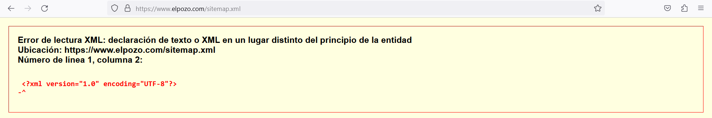

# A08. OSINT Pasivo a El Pozo


**Autor:** Guerrero Merlo, Sergio

## Índice

1. [Introducción](#introducción)
2. [Información de la empresa](#información-de-la-empresa)
3. [Whois de la empresa](#whois-de-la-empresa)
4. [Servidores DNS](#servidores-dns)
5. [Servidores de correo](#servidores-de-correo)
6. [Subdominios](#subdominios)
7. [Información adicional](#información-adicional)</br>
    7.1 [Robots.txt y Sitemap.xml](#robotstxt-y-sitemapxml)</br>
    7.2 [Whatweb y Wappalyzer](#whatweb-y-wappalyzer)</br>
    7.3 [Empleados](#empleados)

## Introducción

Esta actividad se ha realizado con la intención de utilizar las herramientas de OSINT aprendidas en clase y en anteriores actividades para obtener experiencia haciendo OSINT pasivo.

Se intentará sacar la mayor cantidad de información que nos pueda servir para nuestra auditoría y que podamos usar para encontrar posibles vulnerabilidades en nuestro pentesting.

Además no solo obtendremos experiencia con las herramientas sino que también podremos enfrentarnos a un caso de OSINT pasivo real de una empresa conocida.

## Información de la empresa

Una vez obtenidos estos datos, he decidido entrar en la página de Linkedin de la empresa donde podremos encontrar información relevante sobre datos de contacto y la ubicación por ejemplo.

**Dirección de la sede principal:** AVENIDA ANTONIO FUERTES ,1, ALHAMA DE MURCIA, MURCIA 30840, ES

**Teléfono:** 968 63 68 00

Además, la empresa también ha descrito las redes sociales en su página de linkedin.

- Facebook: www.facebook.com/ElPozoAlimentacion 
- Instagram: www.instagram.com/elpozoalimentacion 
- Twitter: www.twitter.com/ElPozoAlimenta 
- YouTube: www.youtube.com/user/spotespeciales

La empresa tiene un número de empleados de entre 1001 y 5000.

## Whois de la empresa

He utilizado diferentes herramientas para encontrar datos whois de la empresa. He utilizado páginas como whois.domaintools.com y página que me ha ayudado a encontrar más información referente a la IP pública que he encontrado en la primera web, he utilizado ip2location.comn para ver cual es el ISP entre otros datos. Con shois.domaintools he sacado la dirección IP pública de la sede de la empresa.

Además de obtener la IP pública, también nos muestra varios datos más, de entre ellos está el AS y el ASN. ASN es el número que se asigna únicamente al AS.

- AS: Telefonica_de_Espana TELEFONICA DE ESPANA S.A.U.
- ASN: AS3352

El ISP de El Pozo es Telefonica España S.A.U, este dato lo he obtenido a través de la página ip2location gracias a la IP pública mencionada anteriormente.

Con Kali Linux he utilizado el comando whois para complementar la información encontrada en las dos páginas mencionadas anteriormente.

whois record
```
Domain Name: ELPOZO.COM
   Registry Domain ID: 1181800_DOMAIN_COM-VRSN
   Registrar WHOIS Server: https://www.arsys.es/dominios/whois
   Registrar URL: http://www.arsys.es
   Updated Date: 2023-05-19T09:34:34Z
   Creation Date: 1997-05-23T04:00:00Z
   Registry Expiry Date: 2024-05-24T04:00:00Z
   Registrar: Arsys Internet, S.L. dba NICLINE.COM
   Registrar IANA ID: 379
   Registrar Abuse Contact Email: 
   Registrar Abuse Contact Phone: +34 941 620 100
   Domain Status: ok https://icann.org/epp#ok
   Name Server: SCEN15.ELPOZO.COM
   Name Server: SCEN17.ELPOZO.COM
   DNSSEC: unsigned
   URL of the ICANN Whois Inaccuracy Complaint Form: https://www.icann.org/wicf/
```
También podemos comprobar que la entidad que registra elpozo.com ahora es arsys.

[Enlace al whois.domaintools](https://whois.domaintools.com/elpozo.com)

## Servidores DNS

Como hemos podido ver en el punto anterior, gracias a whois hemos podido sacar los dns y he hecho nslookup a estos para comprobar la dirección IP de estos servidores DNS.

SCEN15.ELPOZO.COM

```
Respuesta no autoritativa:
Nombre:  SCEN15.ELPOZO.COM
Address:  195.57.134.74
```
SCEN17.ELPOZO.COM

```
Respuesta no autoritativa:
Nombre:  SCEN17.ELPOZO.COM
Address:  195.57.134.76
```

He utilizado dnsrecon en kali linux para enumerar los tipos de registros dns.

```
─# dnsrecon -d elpozo.com                                                                    
[*] std: Performing General Enumeration against: elpozo.com...
[-] DNSSEC is not configured for elpozo.com
[*]      SOA scen17.elpozo.com 195.57.134.76
[*]      NS scen17.elpozo.com 195.57.134.76
[*]      NS scen15.elpozo.com 195.57.134.74
[*]      MX elpozo-com.mail.protection.outlook.com 52.101.68.0
[*]      MX elpozo-com.mail.protection.outlook.com 52.101.68.32
[*]      MX elpozo-com.mail.protection.outlook.com 52.101.68.36
[*]      MX elpozo-com.mail.protection.outlook.com 52.101.73.24
[*]      MX elpozo-com.mail.protection.outlook.com 52.101.68.18
[*]      MX elpozo-com.mail.protection.outlook.com 52.101.68.16
[*]      MX elpozo-com.mail.protection.outlook.com 52.101.73.6
[*]      A elpozo.com 195.57.134.66
[*]      TXT elpozo.com MS=ms72096551
[*]      TXT elpozo.com hFhrcB0MnxT3OQTuOcQvr74wfZOzuJJ8lsgsbSbfIN0+dBlQNGDmlWlZo2LTkrROTEF79hBCjd3pZLsOjLhYvg==
[*]      TXT elpozo.com facebook-domain-verification=rtdbbxoqjj8g8do97obfcvjzwz427d
[*]      TXT elpozo.com v=spf1 include:7185630.spf10.hubspotemail.net include:spf.ipzmarketing.com include:spf.protection.outlook.com include:mailbox.edicomnet.com include:servers.mcsv.net mx ip4:195.57.134.40/29 exists:%{i}.spf.hc1419-85.eu.iphmx.com ~all
[*]      TXT elpozo.com google-site-verification=f20wufKzQEXEw1uSfE_B6DBfOkoh0OxgnjgBoMekn0U
[*]      TXT _dmarc.elpozo.com v=DMARC1;p=reject; sp=reject; rua=mailto:sistemas@grupofuertes.com; ruf=mailto:systemas@grupofuertes.com
[*] Enumerating SRV Records
[+]      SRV _sip._tls.elpozo.com sipdir.online.lync.com 52.112.192.11 443
[+]      SRV _sip._tls.elpozo.com sipdir.online.lync.com 2603:1027:0:3::b 443
[+]      SRV _sip._tls.elpozo.com sipdir.online.lync.com 2603:1027:0:4::b 443
[+]      SRV _sipfederationtls._tcp.elpozo.com sipfed.online.lync.com 52.112.191.65 5061
[+] 4 Records Found

```

Con nslookup he ido comprobando la existencia de estos registros. He utilizado el valor ANY para que encuentre todos los registros.

```
nslookup -query=ANY elpozo.com
Servidor:  liveboxfibra
Address:  192.168.1.1

Respuesta no autoritativa:
elpozo.com      text =

        "facebook-domain-verification=rtdbbxoqjj8g8do97obfcvjzwz427d"
elpozo.com      text =

        "v=spf1 include:7185630.spf10.hubspotemail.net include:spf.ipzmarketing.com include:spf.protection.outlook.com include:mailbox.edicomnet.com include:servers.mcsv.net mx ip4:195.57.134.40/29 exists:%{i}.spf.hc1419-85.eu.iphmx.com ~all"
elpozo.com      text =

        "google-site-verification=f20wufKzQEXEw1uSfE_B6DBfOkoh0OxgnjgBoMekn0U"
elpozo.com      text =

        "MS=ms72096551"
elpozo.com      text =

        "hFhrcB0MnxT3OQTuOcQvr74wfZOzuJJ8lsgsbSbfIN0+dBlQNGDmlWlZo2LTkrROTEF79hBCjd3pZLsOjLhYvg=="
elpozo.com      nameserver = scen15.elpozo.com
elpozo.com      nameserver = scen17.elpozo.com
elpozo.com
        primary name server = scen17.elpozo.com
        responsible mail addr = dnsadmin.elpozo.com
        serial  = 2023111501
        refresh = 14400 (4 hours)
        retry   = 7200 (2 hours)
        expire  = 2419200 (28 days)
        default TTL = 7200 (2 hours)
elpozo.com      internet address = 195.57.134.66
elpozo.com      MX preference = 10, mail exchanger = elpozo-com.mail.protection.outlook.com

scen17.elpozo.com       internet address = 195.57.134.76
```
## Servidores de correo

En el apartado anterior he conseguido sacar información de los registros DNS. Uno de estos registros es el MX que apunta a servidores de correo.

El pozo está protegido y gestionado por outlook.com.

En el siguiente apartado específico cuales son los registros DNS que me han hecho llegar a tal conclusión.

```
MX elpozo-com.mail.protection.outlook.com 52.101.68.0
[*]      MX elpozo-com.mail.protection.outlook.com 52.101.68.32
[*]      MX elpozo-com.mail.protection.outlook.com 52.101.68.36
[*]      MX elpozo-com.mail.protection.outlook.com 52.101.73.24
[*]      MX elpozo-com.mail.protection.outlook.com 52.101.68.18
[*]      MX elpozo-com.mail.protection.outlook.com 52.101.68.16
[*]      MX elpozo-com.mail.protection.outlook.com 52.101.73.6
```

Investigando con clearbit connect he encontrado la extensión de los correos eléctronicos de la empresa que es el siguiente.

- @elpozo.com

Dentro de la extensión @elpozo.com he encontrado varios correos de la empresa fuera de los empleados. Esta información la he encontrado con la herramienta web hunter.io.

- consumidores@elpozo.com
- elpozo@elpozo.com
- bienstar@elpozo.com
- asturias@elpozo.com
- personal@elpozo.com
- exporta@elpozo.com
- comunicacion@elpozo.com

## Subdominios 

ahora utilizaremos varias herramientas para enumerar los subdominios, comrpobar los certificados y mapear las redes.

La primera herramienta que he utilizado es sublist3r en kali linux, esto me ha permitido enumerar una serie de subdominios de la empresa elpozo.com

Con esta herramienta tendremos información sobre la cantidad de subdominios que tenga la empresa en su web elpozo.com.

```
python sublist3r.py -d elpozo.com

                 ____        _     _ _     _   _____
                / ___| _   _| |__ | (_)___| |_|___ / _ __
                \___ \| | | | '_ \| | / __| __| |_ \| '__|
                 ___) | |_| | |_) | | \__ \ |_ ___) | |
                |____/ \__,_|_.__/|_|_|___/\__|____/|_|

                # Coded By Ahmed Aboul-Ela - @aboul3la
    
[-] Enumerating subdomains now for elpozo.com
[-] Searching now in Baidu..
[-] Searching now in Yahoo..
[-] Searching now in Google..
[-] Searching now in Bing..
[-] Searching now in Ask..
[-] Searching now in Netcraft..
[-] Searching now in DNSdumpster..
[-] Searching now in Virustotal..
[-] Searching now in ThreatCrowd..
[-] Searching now in SSL Certificates..
[-] Searching now in PassiveDNS..
[!] Error: Virustotal probably now is blocking our requests
[-] Total Unique Subdomains Found: 26
ac.elpozo.com
autodiscover.elpozo.com
bienstar.elpozo.com
www.bienstar.elpozo.com
bienstar2.elpozo.com
blog.elpozo.com
boletines.elpozo.com
china.elpozo.com
www.china.elpozo.com
correo.elpozo.com
empanados.elpozo.com
www.empanados.elpozo.com
cpanel.empanados.elpozo.com
cpcalendars.empanados.elpozo.com
cpcontacts.empanados.elpozo.com
mail.empanados.elpozo.com
webdisk.empanados.elpozo.com
webmail.empanados.elpozo.com
mail.elpozo.com
promo.elpozo.com
promo1954.elpozo.com
www.promo1954.elpozo.com
promobienstar.elpozo.com
pruebagratis.elpozo.com
ruta1954.elpozo.com
www.ruta1954.elpozo.com
```

Con la herramienta web crt.sh he encontrado una serie de certificados que se emplea en los subdominios de la empresa El Pozo. 

La cantidad de certificados es tan grande que se enumeran algunos en la siguiente tabla. Para ver más certificados [clic aquí.](https://crt.sh/?q=elpozo.com)

| crt.sh ID   | Logged AT         | Not Before   | Not After    | Common Name                | Matching Identities          | Issuer Name                                       |
|-------------|-------------------|--------------|--------------|----------------------------|------------------------------|---------------------------------------------------|
| 11100883463 | 2023-11-14        | 2023-11-14   | 2024-02-12   | blog.elpozo.com            | blog.elpozo.com              | C=US, O=Google Trust Services LLC, CN=GTS CA 1P5 |
| 11100859067 | 2023-11-14        | 2023-11-14   | 2024-02-12   | blog.elpozo.com            | blog.elpozo.com              | C=US, O=Google Trust Services LLC, CN=GTS CA 1P5 |
| 11010501597 | 2023-11-06        | 2023-11-06   | 2024-02-04   | promo1954.elpozo.com       | promo1954.elpozo.com         | www.promo1954.elpozo.com  C=US, O=Let's Encrypt, CN=R3 |
| 11010499690 | 2023-11-06        | 2023-11-06   | 2024-02-04   | promo1954.elpozo.com       | promo1954.elpozo.com         | www.promo1954.elpozo.com  C=US, O=Let's Encrypt, CN=R3 |
| 10866199741 | 2023-10-23        | 2023-10-22   | 2024-01-20   | pruebagratis.elpozo.com    | pruebagratis.elpozo.com      | C=US, O=Let's Encrypt, CN=R3                       |
| 10866195409 | 2023-10-23        | 2023-10-22   | 2024-01-20   | pruebagratis.elpozo.com    | pruebagratis.elpozo.com      | C=US, O=Let's Encrypt, CN=R3                       |
| 10751687800 | 2023-10-12        | 2023-10-12   | 2024-01-10   | promobienstar.elpozo.com   | promobienstar.elpozo.com     | C=US, O=Let's Encrypt, CN=R3                       |
| 10751667626 | 2023-10-12        | 2023-10-12   | 2024-01-10   | promobienstar.elpozo.com   | promobienstar.elpozo.com     | C=US, O=Let's Encrypt, CN=R3                       |
| 10421330831 | 2023-09-19        | 2023-09-19   | 2024-09-25   | *.elpozo.com               | *.elpozo.com, elpozo.com     | C=US, O=DigiCert Inc, OU=www.digicert.com, CN=Thawte TLS RSA CA G1 |
| 10593719944 | 2023-09-16        | 2023-09-16   | 2023-12-15   | blog.elpozo.com            | blog.elpozo.com              | C=US, O=Google Trust Services LLC, CN=GTS CA 1P5 |

## Información adicional

### Robots.txt y sitemap.xml

Una vez llegados a este punto, he decidido investigar otro tipo de información que pueda ser interesante sobre El Pozo, como por ejemplo el archivo robots.txt y el sitemap.xml

Robots.txt

```
 User-agent: *
Disallow: /wp-admin/
Disallow: */?s=*

Sitemap: https://www.elpozo.com/sitemap.rss
```

He intentado encontrar el sitemap.xml usando la dirección web elpozo.com/sitemap.xml y da error, por lo tanto no he podido comprobar esta información. Igualmente he intentado usar también la dirección encontrada en robots.txt y tampoco ha funcionado.



### Whatweb y Wappalyzer

He utilizado la herramienta en kali linux whatweb para comprobar información referente a elpozo.com.

```
http://elpozo.com [301 Moved Permanently] Country[SPAIN][ES], HTTPServer[nginx], IP[195.57.134.66], RedirectLocation[https://www.elpozo.com/], Strict-Transport-Security[max-age=31536000; includeSubdomains; preload], Title[301 Moved Permanently], UncommonHeaders[x-content-type-options,permissions-policy,referrer-policy], X-Frame-Options[SAMEORIGIN], X-XSS-Protection[1; mode=block], nginx
https://www.elpozo.com/ [200 OK] AddThis, Bootstrap[1.2.13], Country[SPAIN][ES], Frame, HTML5, HTTPServer[nginx], IP[195.57.134.66], JQuery[2.2.4], MetaGenerator[All in One SEO (AIOSEO) 4.5.0,Powered by Slider Revolution 6.0.7 - responsive, Mobile-Friendly Slider Plugin for WordPress with comfortable drag and drop interface.,WPML ver:4.6.7 stt:1,4,3,42,2;], Modernizr[2.7.1.min], Open-Graph-Protocol[website], PoweredBy[Slider], Script[application/ld+json,text/javascript], Strict-Transport-Security[max-age=31536000; includeSubdomains; preload], Title[Home - ElPozo Alimentación], UncommonHeaders[link,x-proxy-cache,x-content-type-options,permissions-policy,referrer-policy,content-security-policy], WordPress, X-Frame-Options[SAMEORIGIN], X-UA-Compatible[IE=edge], X-XSS-Protection[1; mode=block], YouTube, nginx
```

Además de utilizar whatweb, he utilizar wappalyzer para comparar la información referente a las tecnologías que usa la web elpozo.com encontradas en Whatweb.

- **Gestor de contenido:** Wordpress
- **CDN:**
    - Cludflare
    - cdnjs
- **Widget:**
    - Slider Revolution versión 6.0.7
    - Addthis
- **Base de datos:** MySQL
- **Tag Manager: Google** Tag Manager
- **Analítica:** Google Analytics GA4
- **Landing Page Builder:** SiteOrigin Page Builder
- **Usan WhatsApp Business Chat**
- **Framework JavaScript:** GSAP versión 1.15.1
- **Librerías de JavaScript:**
    - ScrollMagic versión 2.0.5
    - Lightbox
    - core-js versión 3.31.0
    - Modernizr versión 2.7.1
    - jQuery versión 2.2.4
- **Proxy reverso:** Nginx
- **Servidor web:** Nginx
- **wordpress Plugins:**
    - SiteOrigin Widgets Bundle
    - SiteOrigin Page Builder versión 2.28.0
    - Contact Form 7 versión 5.8.3
    - WPML 4.6.7
- **Lenguaje de programación:** PHP

Con  esta investigación podremos buscar posibles vulnerabilidades en los plugins usados en wsu página web dependiendo de las versiones. 

### Empleados

Como he mencionado en el primer punto [**Información de la empresa**](#información-de-la-empresa), la empresa El Pozo tiene un número de empleados entre 1001 y 5000. Por lo tanto, he investigado a una serie de empleados que me han parecido más relevantes a priori.

#### Cristina Sanchez Sanchez

- **Puesto:** Marketing Manager
- **E-mail empresarial:** cristina.sanchez@elpozo.com
- **Linkedin:** https://www.linkedin.com/in/cristina-sanchez-sanchez-58b00a187/

#### Susana Rico

- **Puesto:** Hrbp Operaciones
- **E-mail empresarial:** susana.rico@elpozo.com
- **Linkedin:** https://www.linkedin.com/in/susana-rico-a34522bb/
- **Educación:** Universidad de Murcia (2012 - 2014)

#### Verena Díaz Pauli

- **Puesto:** Brand Manager
- **E-mail empresarial:** verena@elpozo.com
- **Linkedin:** https://www.linkedin.com/in/verena-d%C3%ADaz-pauli-050a7a38/
- **Educación:**
    - The Manchester Metropolitan University (2002 - 2003) 
    - Universidad de Murcia (1998 - 2003)

#### Xianfan Xu

- **Puesto:** General Manager China Elpozo Shanghai
- **E-mail empresarial:** xianfan.xu@elpozo.com
- **E-mail:** angelxu92@gmail.com
- **Linkedin:** https://www.linkedin.com/in/xianfan-xu-b1918b93/
- **Educación:** 
    - EAE Business School (2021 - 2022)
    - Universidad Pontificia Comillas ICAI-ICADE (2010 - 2014)

#### Julián González García

- **Puesto:** Director de Marketing
- **E-mail empresarial:** julian.garcia@elpozo.com
- **Linkedin:** https://www.linkedin.com/in/juli%C3%A1n-gonz%C3%A1lez-garc%C3%ADa-4ba78476/

#### Salvador Lucas

- **Puesto:** Core Category Manager Medios Productivos
- **E-mail empresarial:** salvador.lucas@elpozo.com
- **Linkedin:** https://www.linkedin.com/in/salvador-lucas-0b466656/

#### Alfonso Rubio Corral

- **Puesto:** Digital Brand Manager
- **E-mail empresarial:** alfonso.corral@elpozo.com
- **Linkedin:** https://www.linkedin.com/in/alfonso-j-rubio/
- **Instagran:** https://www.instagram.com/alfonsojrc/
- **Twitter:** https://twitter.com/Alfonsojrc
- **Educación:**
    - ThePower Business School (2019 - 2020)
    - IEM Digital Business School (2015 - 2016)
    - ENAE Business School (2010 - 2011)
    - Universidad de Murica (2005 - 2009)

Esta información de los empleados encontrados en Clearbit Connect es relevante en caso de querer hacerles Phishing ya que tenemos correos electrónicos de la empresa y personal en el caso de uno de los empleados. 

También sabemos algunos perfiles de redes sociales que pueden ser usados para investigar los gustos, post y con quién se relacionan estos empleados.

Y sabiendo donde estudiaron también podemos usarlo para hacerles phishing haciendonos pasar por esos centros donde han cursado sus estudios o utilizando sock puppets que puedan haber estudiado allí.

Por ejemplo, el Sock Puppet creado en una de las actividades, en mi caso es de Murcia pero estudia fuera, gracias a este Sock Puppet podría acercarme en las redes sociales a alguno de los empleados de la sede principal que se encuentra en Murcia.
